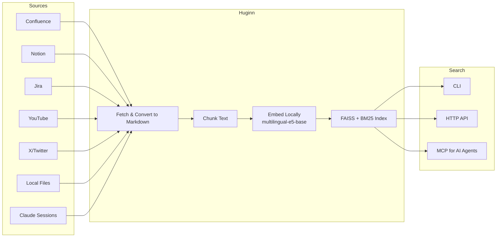
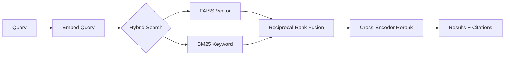
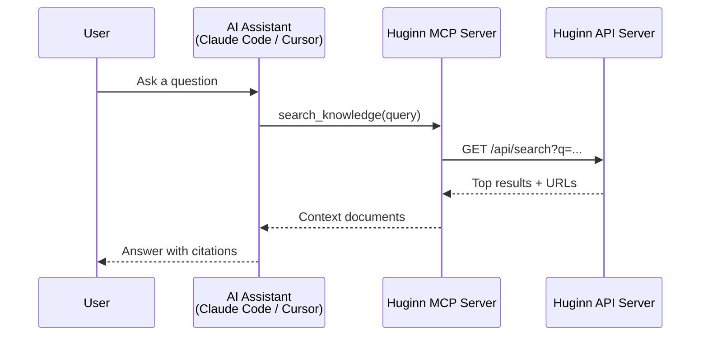
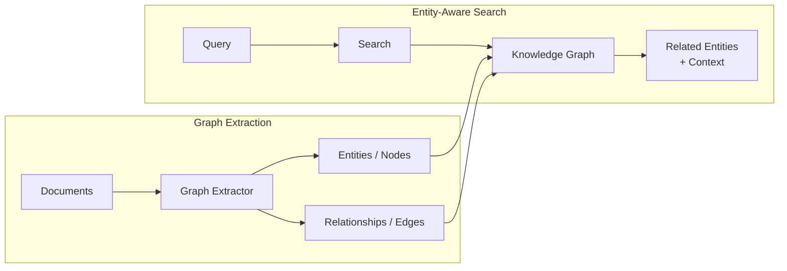
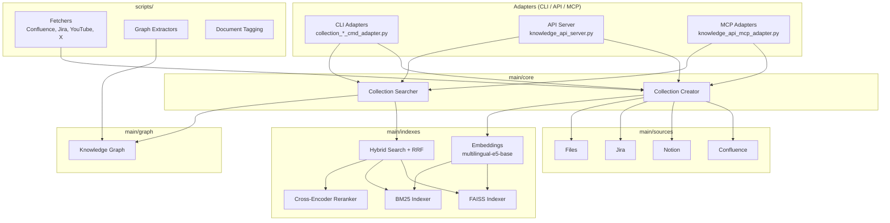

# Huginn

Index and search documents from multiple sources using local vector embeddings. Named after Odin's raven of thought — the companion to [Muninn](https://github.com/RuneLind/muninn).

## What it does

Huginn fetches documents from **Confluence**, **Notion**, **Jira**, **YouTube**, **X/Twitter**, and **local files**, chunks them, generates vector embeddings locally, and stores them in a FAISS index. You can then search across all your knowledge sources via CLI, HTTP API, or MCP (Model Context Protocol) for AI agents.



**Key features:**
- Fully local — no data leaves your machine (embeddings, indexing, search all run locally)
- Multilingual search (100+ languages via `intfloat/multilingual-e5-base`)
- Hybrid search: FAISS vector + BM25 keyword
- Cross-encoder reranking for precision
- Knowledge graph support for entity-aware search
- LLM-powered document tagging with constrained taxonomies
- MCP integration for AI coding assistants (Claude Code, Cursor, etc.)
- HTTP API server for low-latency search (<50ms)

## Quick Start

```bash
git clone https://github.com/RuneLind/huginn.git
cd huginn
uv sync    # install uv first: https://docs.astral.sh/uv/
```

### Set up your first collection

Pick a source and run the setup script:

```bash
# Local files (markdown, PDF, DOCX, etc.) — simplest, no auth needed
./examples/setup-local-files.sh /path/to/docs my-docs

# Notion workspace
NOTION_TOKEN="secret_..." ./examples/setup-notion.sh my-notion

# YouTube channel transcripts
./examples/setup-youtube.sh "https://www.youtube.com/@ChannelName/videos" my-channel

# Claude Code session transcripts
./examples/setup-claude-sessions.sh

# Confluence space (requires Playwright: uv run playwright install chromium)
CONF_TOKEN="Bearer ..." ./examples/setup-confluence.sh MYSPACE my-confluence

# Jira project (requires Playwright: uv run playwright install chromium)
JIRA_TOKEN="Bearer ..." ./examples/setup-jira.sh MYPROJECT my-jira
```

### Search

```bash
# CLI search
uv run collection_search_cmd_adapter.py --collection my-notion --query "how does auth work"

# Start the API server
uv run knowledge_api_server.py --collections my-notion --port 8321
# Then: curl "http://localhost:8321/api/search?q=auth&collection=my-notion"
```

Your data lives in `data/` (gitignored) — source markdown in `data/sources/`, indexes in `data/collections/`.

## API Server

```bash
uv run knowledge_api_server.py --collections my-notion my-confluence --port 8321
```



Endpoints:
- `GET /api/search?q=...&collection=...&limit=10` — Hybrid search with reranking
- `GET /api/collections` — List loaded collections
- `GET /api/document/{collection}/{doc_id}` — Full document
- `GET /api/graph/{node_id}` — Knowledge graph node
- `GET /health` — Health check

## MCP Integration



Use with Claude Code, Cursor, or any MCP-compatible client. Start the API server, then add to your MCP config:

```json
{
  "mcpServers": {
    "huginn": {
      "command": "uv",
      "args": ["--directory", "/path/to/huginn", "run", "knowledge_api_mcp_adapter.py"],
      "env": {
        "KNOWLEDGE_API_URL": "http://localhost:8321",
        "KNOWLEDGE_COLLECTIONS": "my-notion,my-confluence",
        "KNOWLEDGE_DESCRIPTION": "Search my team's Notion workspace and Confluence docs"
      }
    }
  }
}
```

The `KNOWLEDGE_DESCRIPTION` tells the AI agent what it's searching, so it knows when to use the tool.

## Updating Collections

Incremental updates (only fetches new/modified documents):
```bash
uv run collection_update_cmd_adapter.py --collection my-collection
```

## Step-by-Step Source Setup

The setup scripts above handle everything automatically. If you prefer manual control:

<details>
<summary>Notion (manual steps)</summary>

```bash
# Download (requires NOTION_TOKEN env var)
uv run notion_collection_create_cmd_adapter.py --downloadOnly --saveMd ./data/sources/my-notion

# Clean up stubs
uv run notion_cleanup_md.py --saveMd ./data/sources/my-notion

# Index
uv run files_collection_create_cmd_adapter.py \
  --basePath ./data/sources/my-notion --collection my-notion \
  --excludePatterns "^\.excluded/.*"
```
</details>

<details>
<summary>Confluence (manual steps)</summary>

```bash
# Requires: uv run playwright install chromium
uv run scripts/confluence/fetchers/confluence_fetcher_hierarchical.py \
  --space MYSPACE --saveMd ./data/sources/my-confluence

uv run confluence_cleanup_md.py --saveMd ./data/sources/my-confluence --minWordCount 30 --sanitize

uv run files_collection_create_cmd_adapter.py \
  --basePath ./data/sources/my-confluence --collection my-confluence \
  --excludePatterns "^\.excluded/.*"
```
</details>

<details>
<summary>Jira (manual steps)</summary>

```bash
# Requires: uv run playwright install chromium
uv run scripts/jira/fetchers/jira_fetcher.py --saveMd ./data/sources/my-jira --project MYPROJECT

uv run jira_cleanup_md.py --saveMd ./data/sources/my-jira --minWordCount 30

uv run files_collection_create_cmd_adapter.py \
  --basePath ./data/sources/my-jira --collection my-jira \
  --excludePatterns "^\.excluded/.*"
```
</details>

<details>
<summary>YouTube (manual steps)</summary>

```bash
uv run youtube_fetch_cmd_adapter.py \
  --channelUrl "https://www.youtube.com/@ChannelName/videos" \
  --channelName my-channel

uv run youtube_preprocess_md.py --saveMd ./data/sources/my-channel/markdown/my-channel

uv run files_collection_create_cmd_adapter.py \
  --basePath ./data/sources/my-channel/markdown/my-channel --collection my-channel
```
</details>

## Knowledge Graph

Build a knowledge graph from your documents for entity-aware search:



```bash
# Extract graph from Jira issues (epics + cross-references)
uv run scripts/knowledge_graph/extract_jira_graph.py \
  --source ./data/sources/my-jira --output ./my_jira_graph.json

# Start server with graph
KNOWLEDGE_GRAPH_PATH=./my_graph.json JIRA_GRAPH_PATH=./my_jira_graph.json \
  uv run knowledge_api_server.py --collections my-collection
```

Write your own graph extractors for domain-specific entity extraction.

## Document Tagging

Tag documents with LLM-generated topic tags from constrained taxonomies:

```bash
# Discover tags (free-form exploration)
uv run scripts/tagging/discover_tags.py --source data/sources/my-docs \
  --description "my domain" --sample 200 --output discovery.json

# Tag with taxonomy
uv run scripts/tagging/tag_documents.py --source data/sources/my-docs \
  --taxonomy my_taxonomy.json
```

## Authentication

| Source | Environment Variables |
|--------|----------------------|
| Confluence/Jira Server | `CONF_TOKEN` / `JIRA_TOKEN` (Bearer) or `CONF_LOGIN` + `CONF_PASSWORD` |
| Confluence/Jira Cloud | `ATLASSIAN_EMAIL` + `ATLASSIAN_TOKEN` |
| Notion | `NOTION_TOKEN` |

See `.env.example` for a template.

## Advanced: Private Domain Collections

For organizing private, domain-specific collections (work projects, team knowledge, etc.), create gitignored folders inside huginn with their own git repos:

```
huginn/
├── main/                        # open-source core
├── examples/
├── data/                        # gitignored — your indexed data
├── my-work/                     # gitignored — private git repo
│   ├── taxonomies/              # domain-specific tag taxonomies
│   ├── graphs/                  # domain knowledge graphs
│   └── start.sh                 # start with work collections
├── my-personal/                 # gitignored — private git repo
│   └── start.sh                 # start with personal collections
└── start.sh                     # gitignored — your combined start script
```

Each private folder can be its own git repo, pushed to a private remote. Add them to `.gitignore`:

```
my-work/
my-personal/
start.sh
```

Use `--data-path` when data lives outside the default `./data/collections`:
```bash
uv run knowledge_api_server.py \
  --data-path /path/to/shared/data/collections \
  --collections my-work-docs my-personal-notes
```

## Architecture



```
main/
  core/           — Collection creator + searcher
  sources/        — Source adapters (Confluence, Jira, Notion, Files)
  indexes/        — FAISS, BM25, hybrid search, embeddings, reranking
  graph/          — Knowledge graph engine
  persisters/     — Disk storage
  utils/          — Batching, logging, progress
scripts/          — Fetchers, graph extractors, tagging tools
examples/         — Setup scripts and templates
```

See [docs/HOW_IT_WORKS.md](docs/HOW_IT_WORKS.md) for the full architecture walkthrough.

## License

MIT
