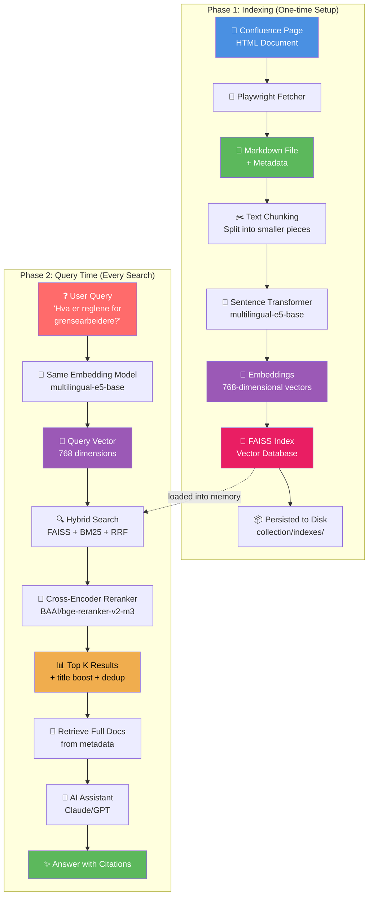
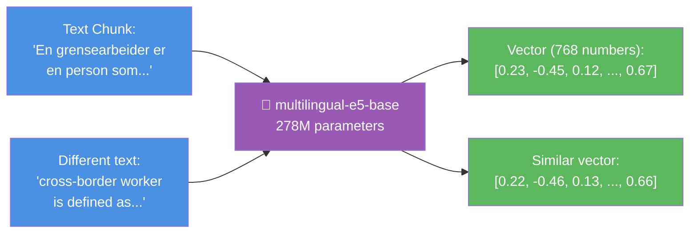
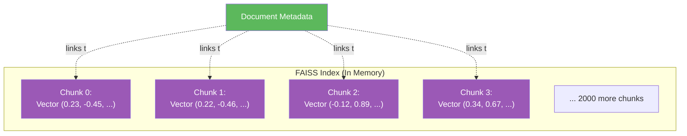
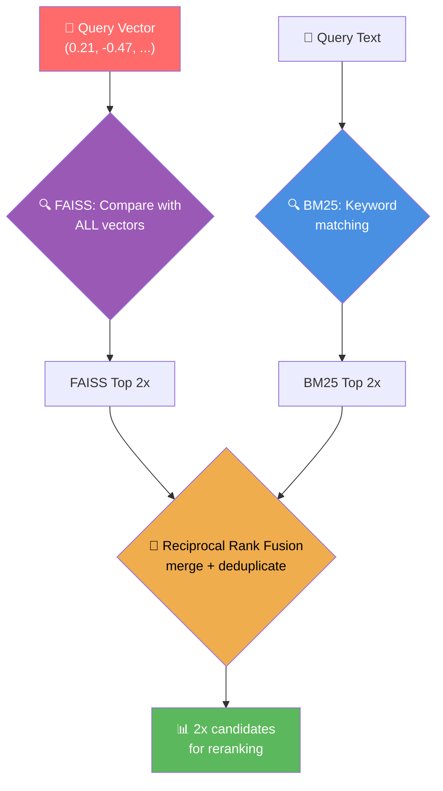
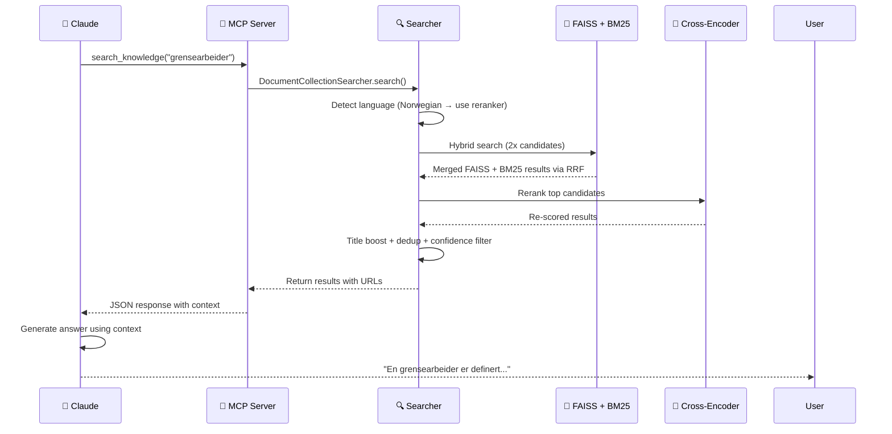

# How Documents-Vector-Search Works

A comprehensive guide to understanding the complete pipeline from document to AI-powered answers.

## 📋 Table of Contents

- [Overview](#overview)
- [The Complete Pipeline](#the-complete-pipeline)
- [Detailed Example](#detailed-example)
- [Query Time: How Search Works](#query-time-how-search-works)
- [Knowledge Graph Enhancement](#knowledge-graph-enhancement)
- [Why This Works: Semantic Understanding](#why-this-works-semantic-understanding)
- [Performance Characteristics](#performance-characteristics)
- [Memory & Storage](#memory--storage)
- [Integration with MCP](#integration-with-mcp)
- [Technical Deep Dive](#technical-deep-dive)

---

## Overview

This document explains how the documents-vector-search system works end-to-end, using a concrete example:

**Query:** "Hva er reglene for grensearbeidere?" _(What are the rules for cross-border workers?)_

---

## The Complete Pipeline



---

## Detailed Example

### Step 1: Source Document (Confluence)

Original HTML from Confluence:

```html
<!-- Confluence HTML -->
<h2>Grensearbeider</h2>
<p>En grensearbeider er en person som utfører lønnet arbeid i en 
medlemsstat, men bor i en annen medlemsstat som de vanligvis 
vender tilbake til daglig eller minst en gang i uken.</p>

<p>Definert i forordning (EF) nr. 883/2004 artikkel 1(f).</p>

<h3>Eksempel</h3>
<p>Bo i Sverige, jobbe i Norge = grensearbeider</p>
```

### Step 2: Convert to Markdown

The system converts HTML to clean Markdown with frontmatter metadata:

```markdown
---
title: Definisjoner i forordningene
page_id: 123456789
space: MYSPACE
url: https://confluence.example.com/spaces/MYSPACE/pages/123456789
---

## Grensearbeider

En grensearbeider er en person som utfører lønnet arbeid i en 
medlemsstat, men bor i en annen medlemsstat som de vanligvis 
vender tilbake til daglig eller minst en gang i uken.

Definert i forordning (EF) nr. 883/2004 artikkel 1(f).

### Eksempel

Bo i Sverige, jobbe i Norge = grensearbeider
```

### Step 3: Text Chunking

The document is split into overlapping chunks (default ~500 characters with overlap):

```python
# Chunk 1
"""
title: Definisjoner i forordningene

## Grensearbeider

En grensearbeider er en person som utfører lønnet arbeid i en 
medlemsstat, men bor i en annen medlemsstat som de vanligvis 
vender tilbake til daglig eller minst en gang i uken.
"""

# Chunk 2
"""
En grensearbeider er en person som utfører lønnet arbeid i en 
medlemsstat, men bor i en annen medlemsstat som de vanligvis 
vender tilbake til daglig eller minst en gang i uken.

Definert i forordning (EF) nr. 883/2004 artikkel 1(f).
"""

# Chunk 3
"""
Definert i forordning (EF) nr. 883/2004 artikkel 1(f).

### Eksempel

Bo i Sverige, jobbe i Norge = grensearbeider
"""
```

**Why chunks?**
- AI models have token limits (can't process entire documents at once)
- Better relevance (find specific sections rather than entire documents)
- Overlapping ensures context isn't lost at chunk boundaries

### Step 4: Generate Embeddings



**What is an embedding?**

An embedding is a vector (list of numbers) that captures the **semantic meaning** of text. Similar meanings produce similar vectors, even across languages!

```python
from sentence_transformers import SentenceTransformer

model = SentenceTransformer('intfloat/multilingual-e5-base')

# Norwegian text (e5 models require "passage: " prefix for documents)
chunk_no = "passage: En grensearbeider er en person som utfører lønnet arbeid..."
embedding_no = model.encode(chunk_no)
# → [0.23, -0.45, 0.12, 0.89, -0.34, ..., 0.67]  (768 numbers)

# English text with SAME meaning
chunk_en = "passage: A cross-border worker is a person who performs paid work..."
embedding_en = model.encode(chunk_en)
# → [0.22, -0.46, 0.13, 0.88, -0.35, ..., 0.66]  (very similar!)

# Unrelated text
chunk_other = "passage: The weather forecast for tomorrow is sunny..."
embedding_other = model.encode(chunk_other)
# → [-0.67, 0.12, -0.89, 0.34, 0.56, ..., -0.23]  (very different!)
```

**Key insight:** Semantically similar text produces similar vectors, even in different languages!

### Step 5: Store in FAISS + BM25 Indexes



**FAISS structure:**

```python
import faiss

# Create index for 768-dimensional vectors
index = faiss.IndexFlatL2(768)

# Add all chunk embeddings
index.add(all_embeddings)  # Shape: (2000, 768)

# Save to disk
faiss.write_index(index, "collection/indexes/faiss_index")
```

A **BM25 index** is also built alongside FAISS for keyword matching. At search time, both are queried and results merged with Reciprocal Rank Fusion (RRF).

**Metadata stored separately:**

```json
{
  "chunk_0": {
    "document_id": "123456789_Definisjoner",
    "url": "https://confluence.example.com/spaces/MYSPACE/pages/123456789",
    "title": "Definisjoner i forordningene",
    "chunk_text": "En grensearbeider er en person som..."
  }
}
```

---

## Query Time: How Search Works

### Step 1: User Asks Question

```
User: "Hva er reglene for grensearbeidere?"
```

### Step 1b: Knowledge Graph Enhancement

> 📚 For the operational side — *which* collections should be enriched by which kind of graph (LLM-extracted vs hand-curated wikilinks), and when to re-run the extractor — see [`knowledge-graph-when-to-use-what.md`](knowledge-graph-when-to-use-what.md). For the alternative pattern of building a hand-curated wiki collection, see [`wiki-collection-pattern.md`](wiki-collection-pattern.md).

Before vector search, the query is analyzed against the knowledge graph (built by LLM entity extraction):

```python
# Detect entities in the query
detected = graph.detect_entities("Hva er reglene for grensearbeidere?")
# → ["entity:grensearbeider", "entity:forordning"]

# Expand query with graph neighbors (1-hop traversal)
expansion_terms = graph.get_expansion_terms(detected)
# → ["grensearbeider", "Artikkel 13", "EØS", "trygdeforordningen"]

search_q = query + " " + " ".join(expansion_terms)
# → "Hva er reglene for grensearbeidere? grensearbeider Artikkel 13 EØS trygdeforordningen"
```

Entity detection uses two methods:
- **Regex patterns** for known formats (BUC codes, SED codes, Jira keys, article references)
- **LLM graph label matching** for entities discovered during extraction (case-insensitive substring match against all `entity:*` node labels)

The expanded query finds documents that discuss the topic indirectly — for example, a page about "Artikkel 13" that never mentions "grensearbeider" but is directly relevant.

### Step 2: Convert Query to Vector

```python
# e5 models require "query: " prefix for queries
query = "query: Hva er reglene for grensearbeidere?"
query_embedding = model.encode(query)
# → [0.21, -0.47, 0.14, 0.87, -0.36, ..., 0.65]  (768 numbers)
```

### Step 3: Hybrid Search (FAISS + BM25)



The system runs **two parallel searches** and merges results:
- **FAISS** finds semantically similar chunks (understands meaning across languages)
- **BM25** finds keyword-matching chunks (catches exact terms FAISS might miss)
- **RRF** merges both lists using `score(d) = sum(1 / (k + rank_i(d)))` across retrievers

### Step 3b: Cross-Encoder Reranking

The top candidates are re-scored by a **cross-encoder** (`BAAI/bge-reranker-v2-m3`) that reads query and document *together* through the full transformer — much more accurate than comparing pre-computed vectors:

```python
# Cross-encoder scores query-document pairs jointly
reranker.rerank(query, candidates)
# Re-scores and re-orders by relevance
```

After reranking, **title boost** adjusts scores for documents whose filename matches query terms, and **deduplication** removes documents with identical text content.

**Note:** For English queries (3+ words), the reranker is automatically skipped because it collapses scores for cross-lingual (EN→NO) pairs. The hybrid search scores are used directly.

### Step 3c: Graph Context Enrichment

After ranking, each result is annotated with structured relationship information from the knowledge graph:

```python
# For each result, detect entities in its title and add graph context
for result in results:
    entities = graph.detect_entities(result["title"])
    result["graph_context"] = [graph.get_entity_context(e) for e in entities]
```

**Example:** A result titled "Definisjoner i forordningene" gets annotated with:
```
graph_context: [
  "Forordning 883/2004 (Concept) | regulates Trygdeavgift, defines grensearbeider | 22 mentions"
]
```

This gives AI agents consuming search results immediate understanding of how concepts relate — without needing additional context retrieval.

### Step 4: Retrieve Full Context

```python
results = []
for idx in indices:
    chunk_metadata = load_metadata(idx)
    results.append({
        "text": chunk_metadata["chunk_text"],
        "url": chunk_metadata["url"],
        "title": chunk_metadata["title"],
        "score": distances[idx],
        "graph_context": [...]  # entity relationships from knowledge graph
    })
```

**Example result:**

```json
{
  "text": "En grensearbeider er en person som utfører lønnet arbeid i en medlemsstat...",
  "url": "https://confluence.example.com/spaces/MYSPACE/pages/123456789",
  "title": "Definisjoner i forordningene",
  "score": 0.12,
  "graph_context": ["Forordning 883/2004 (Concept) | regulates Trygdeavgift, defines grensearbeider"]
}
```

### Step 5: Send to AI Assistant

```python
# MCP sends results to Claude
context = "\n\n".join([r["text"] for r in results])

prompt = f"""
Based on this documentation:

{context}

Answer: {query}
"""

# Claude generates answer using the context
```

### Step 6: AI Generates Answer

```
🤖 Claude responds:

En grensearbeider er definert i forordning (EF) nr. 883/2004 artikkel 1(f) 
som en person som utfører lønnet arbeid i en medlemsstat, men bor i en annen 
medlemsstat som de vanligvis vender tilbake til daglig eller minst en gang i uken.

Eksempel: En person som bor i Sverige men jobber i Norge regnes som grensearbeider.

Kilde: https://confluence.example.com/spaces/MYSPACE/pages/123456789
```

---

## Why This Works: Semantic Understanding

### Traditional Keyword Search

```
Query: "grensearbeidere"
Matches: Documents containing exact word "grensearbeidere"
Misses: 
  - "cross-border workers" (different language)
  - "pendlere" (synonym)
  - "artikkel 1(f)" (related regulation)
```

### Vector Semantic Search

```
Query: "grensearbeidere" 
        ↓ (embedding)
    [0.21, -0.47, 0.14, ...]
        ↓ (similarity search)
Finds similar vectors:
  ✅ "grensearbeider" [0.23, -0.45, ...] → distance 0.12
  ✅ "cross-border worker" [0.22, -0.46, ...] → distance 0.15
  ✅ "artikkel 1(f)" [0.19, -0.48, ...] → distance 0.23
  ✅ "pendler over grensen" [0.24, -0.44, ...] → distance 0.18
  ❌ "kattepuser" [-0.89, 0.34, ...] → distance 2.45
```

**The magic:** The embedding model learned from 1+ billion sentence pairs that these terms are semantically related!

### Comparison Table

| Feature | Keyword Search | Vector Semantic Search |
|---------|---------------|------------------------|
| **Cross-language** | ❌ Misses translations | ✅ Finds "cross-border worker" |
| **Synonyms** | ❌ Misses "pendler" | ✅ Finds synonyms |
| **Related concepts** | ❌ Misses "artikkel 1(f)" | ✅ Finds related regulations |
| **Typos** | ❌ "grensearbeidre" = no match | ✅ Still finds similar vectors |
| **Context** | ❌ "apple" (fruit or company?) | ✅ Understands from context |

---

## Knowledge Graph Enhancement

Standard vector search treats documents as isolated text. The knowledge graph adds a layer of structured understanding by capturing entities and their relationships across the entire document collection.

### How the Graph is Built

A local LLM (Ollama, qwen3.5) processes each document to extract entities and relationships:

```
Document: "Trygdeavgift beregnes av næringsinntekt og utenlandsk inntekt, og betales til NAV via Melosys"
    ↓ LLM extraction
Entities:  Trygdeavgift (Concept), Næringsinntekt (Concept), NAV (Organization), Melosys (Product)
Relations: Trygdeavgift --calculated_from--> Næringsinntekt
           Trygdeavgift --paid_to--> NAV
           Trygdeavgift --improves--> Melosys
```

This runs fully locally — no data leaves the machine. Results are cached per document for incremental updates.

### Three Ways the Graph Enhances Search

| Enhancement | When | What happens |
|-------------|------|-------------|
| **Entity detection** | Query arrives | Matches query terms against graph entities (regex + label matching) |
| **Query expansion** | Before search | Adds related terms from graph neighbors to the search query |
| **Context enrichment** | After ranking | Annotates each result with entity relationships |

### Current Scale

The knowledge graph currently contains **8,096 entities** and **15,022 relationships** across three collections (youtube-summaries, melosys-confluence, jira-issues). Entity types include Technology, Product, Organization, Concept, and Person.

For detailed architecture and diagrams, see [graph-enhanced-rag.html](graph-enhanced-rag.html).

---

## Performance Characteristics


**Performance breakdown (my-notion, 17K chunks, MPS GPU):**

| Component | Time | Notes |
|-----------|------|-------|
| Embed query | ~87ms | multilingual-e5-base on MPS |
| FAISS search | ~2ms | IndexFlatL2 brute-force |
| BM25 search | ~6ms | In-memory keyword index |
| Hybrid total (embed + search + RRF) | ~15ms | Without reranker |
| Cross-encoder rerank (30 pairs) | ~940ms | BAAI/bge-reranker-v2-m3, batch_size=8 |
| Title boost + dedup | <1ms | Score adjustment + MD5 hashing |
| **End-to-end with reranker** | **~1,000ms** | |
| **End-to-end without reranker** | **~40ms** | English queries, or no reranker configured |

The cross-encoder dominates total latency (~96%). For English queries, it is automatically skipped, giving ~40ms response times.

---

## Memory & Storage

### Disk Storage

```
Collection: my-confluence (400 documents)

data/collections/my-confluence/
├── indexes/
│   └── faiss_index/
│       └── indexer (3-5 MB)          ← All 2000 embeddings
├── metadata/
│   └── chunks.json (1-2 MB)          ← Document mappings
└── documents/
    └── markdown/ (500 KB)            ← Original files (optional)

Total: ~5-7 MB on disk
```

### Memory When Loaded

```
┌─────────────────────────────┬──────────┐
│ Component                   │ Size     │
├─────────────────────────────┼──────────┤
│ Python process (base)       │  ~30 MB  │
│ Embedding model (e5-base)   │ ~550 MB  │
│ FAISS index (400 docs)      │   ~5 MB  │
│ Metadata                    │   ~1 MB  │
│ Libraries (numpy, faiss)    │  ~50 MB  │
├─────────────────────────────┼──────────┤
│ TOTAL                       │ ~180 MB  │
└─────────────────────────────┴──────────┘
```

### Scaling with More Documents

| Documents | Chunks (approx) | FAISS Size | Total RAM |
|-----------|----------------|------------|-----------|
| 400       | 2,000          | 3 MB       | 180 MB    |
| 1,000     | 5,000          | 8 MB       | 185 MB    |
| 10,000    | 50,000         | 80 MB      | 250 MB    |
| 100,000   | 500,000        | 800 MB     | 950 MB    |

**Note:** Embedding model (~550 MB) and cross-encoder reranker (~1.1 GB) remain constant regardless of document count!

---

## Integration with MCP

### Complete Search Flow



### MCP Configuration Example

```json
{
  "mcpServers": {
    "my-confluence": {
      "command": "uv",
      "args": [
        "--directory",
        "/path/to/huginn",
        "run",
        "collection_search_mcp_stdio_adapter.py",
        "--collection",
        "my-confluence",
        "--maxNumberOfChunks",
        "50"
      ]
    }
  }
}
```

### Multi-Collection Setup

```json
{
  "mcpServers": {
    "my-docs": {
      "command": "uv",
      "args": [
        "--directory",
        "/path/to/huginn",
        "run",
        "multi_collection_search_mcp_adapter.py",
        "--collections",
        "my-confluence",
        "my-jira",
        "my-vakt",
        "--maxNumberOfChunks",
        "50"
      ]
    }
  }
}
```

**Advantage:** Single MCP server with shared embedding model (saves ~180 MB RAM per additional collection!)

---

## Technical Deep Dive

### Complete Code Flow

#### 1. Indexing (One-time Setup)

```python
from documents_vector_search import *

# Read markdown files
files = load_markdown_files("./confluence_hierarchical/markdown")

# Chunk documents
chunks = []
for file in files:
    chunks.extend(chunk_text(file.content, chunk_size=500, overlap=100))

# Generate embeddings
embedder = SentenceEmbedder("intfloat/multilingual-e5-base")
embeddings = embedder.embed_batch([c.text for c in chunks])

# Build FAISS index
indexer = FaissIndexer(embedder)
for embedding, chunk in zip(embeddings, chunks):
    indexer.add(embedding, chunk.metadata)

# Save to disk
indexer.save("data/collections/my-confluence")
```

#### 2. Searching (Every Query)

```python
from documents_vector_search import *

# Load index from disk (happens once at MCP server startup)
searcher = DocumentCollectionSearcher.load("my-confluence")

# Search (happens for every query)
query = "Hva er reglene for grensearbeidere?"
results = searcher.search(query, top_k=5)

# Results ready for AI!
for result in results:
    print(f"Score: {result.score:.3f}")
    print(f"Text: {result.text[:100]}...")
    print(f"URL: {result.url}")
    print()
```

### Embedding Model: intfloat/multilingual-e5-base

**Specifications:**
- **Parameters:** 278 million
- **Output dimensions:** 768
- **Languages:** 100+ (including Norwegian, with strong cross-lingual understanding)
- **Model size:** ~550 MB
- **Inference speed:** ~87ms per query (MPS GPU)
- **Special requirement:** Queries must be prefixed with `"query: "`, documents with `"passage: "` (handled automatically by `SentenceEmbedder`)

**Is it an LLM?**

No! It's an **embedding model**, not a language model:

| Feature | LLM (Claude) | Embedding Model (e5-base) |
|---------|-------------|---------------------------|
| **Size** | ~billions params | 278M params |
| **Input** | Text | Text |
| **Output** | New text | Vector (768 numbers) |
| **Can generate?** | ✅ Yes | ❌ No |
| **Can understand similarity?** | ❌ No (must generate) | ✅ Yes (directly) |
| **Speed** | Slow (generates word-by-word) | Fast (one pass) |
| **Use case** | Conversation, analysis | Search, matching |

**They work together in RAG:**
1. **Embedding model** finds relevant documents (fast, efficient)
2. **LLM** reads and answers based on those documents (slow, intelligent)

### FAISS Index: IndexFlatL2

**What is FAISS?**

FAISS (Facebook AI Similarity Search) is a library from Meta for efficient similarity search in large collections of vectors.

**IndexFlatL2 explained:**

```python
import faiss

# Create index for 768-dimensional vectors
# "Flat" = brute-force (checks all vectors)
# "L2" = Euclidean distance metric
index = faiss.IndexFlatL2(768)

# Add vectors
index.add(embeddings)  # Shape: (num_chunks, 768)

# Search
distances, indices = index.search(query_vector, k=5)
```

**How it works:**

1. Stores all vectors in memory as a matrix
2. During search, computes distance to ALL vectors
3. Returns top K closest matches

**L2 distance formula:**

```
distance = √(Σ(query[i] - doc[i])²)
         = √((q₁-d₁)² + (q₂-d₂)² + ... + (q₃₈₄-d₃₈₄)²)
```

Smaller distance = more similar!

**Alternative FAISS indexes:**

| Index Type | Speed | Accuracy | Memory | Best For |
|-----------|-------|----------|--------|----------|
| IndexFlatL2 | Medium | 100% | Medium | <100k docs (current) |
| IndexHNSWFlat | Fast | ~95% | High | >100k docs |
| IndexIVFFlat | Fast | ~90% | Low | >1M docs |

### Chunking Strategy

**Why chunk documents?**

1. **Token limits** - LLMs have maximum input sizes
2. **Precision** - Find specific sections, not entire documents
3. **Relevance** - Smaller chunks = more focused results

**Chunking parameters:**

```python
chunk_size = 500      # Target characters per chunk
overlap = 100         # Characters to overlap between chunks
```

**Example:**

```
Original document: 1500 characters
Chunks:
  [0:500]     ← Chunk 1
    [400:900]   ← Chunk 2 (overlaps with 1)
      [800:1300]  ← Chunk 3 (overlaps with 2)
        [1200:1500] ← Chunk 4 (overlaps with 3)
```

**Overlap ensures:**
- Context isn't lost at boundaries
- Important phrases spanning boundaries are captured
- Better retrieval quality

---

## FAQ

### Q: Why not use a traditional database like PostgreSQL?

**Answer:** Vector search requires specialized algorithms. While PostgreSQL + pgvector works, FAISS is optimized specifically for this use case:

| Feature | PostgreSQL + pgvector | FAISS |
|---------|----------------------|-------|
| **Search speed** | 50-500ms | 1-10ms |
| **Setup complexity** | High (database, indexes) | Low (Python library) |
| **Scaling** | Good (millions of rows) | Perfect (1k-1M vectors) |
| **Deployment** | Requires database server | Embedded in Python |
| **Memory** | Depends on DB cache | All in RAM (fast!) |

**For MCP use case:** FAISS is superior for instant responses with minimal infrastructure.

### Q: Can I use a different embedding model?

**Yes!** You can use any model from HuggingFace. The system auto-detects which model was used for an index:

```python
# Current default (multilingual, strong Norwegian support)
embedder = SentenceEmbedder("intfloat/multilingual-e5-base")  # 550 MB, 768 dims

# Legacy (English-only, still supported for old collections)
embedder = SentenceEmbedder("all-MiniLM-L6-v2")  # 90 MB, 384 dims
```

**Trade-offs:**
- Smaller models: Faster, less accurate
- Larger models: Slower, more accurate
- Different models: NOT compatible (must re-index all documents!)

### Q: How do I update the index when documents change?

**Full re-index (simple):**

```bash
# Re-run the crawler
uv run confluence_fetcher_hierarchical.py

# Re-create collection
uv run files_collection_create_cmd_adapter.py \
  --basePath "./confluence_hierarchical/markdown" \
  --collection "my-confluence"
```

**Incremental update (faster):**

```bash
# Update specific documents
uv run collection_update_cmd_adapter.py \
  --collection "my-confluence" \
  --basePath "./updated_documents"
```

### Q: What's the maximum number of documents?

**Practical limits:**

| Documents | RAM Usage | Search Time | Recommendation |
|-----------|-----------|-------------|----------------|
| <1k       | ~180 MB   | <10ms      | Perfect! ✅ |
| 1k-10k    | ~200 MB   | 10-20ms    | Great ✅ |
| 10k-100k  | ~400 MB   | 20-100ms   | Consider HNSW ⚠️ |
| >100k     | >1 GB     | >100ms     | Use HNSW index ⚠️ |

For very large collections (>100k docs), switch to `IndexHNSWFlat` for 10-100x speedup.

### Q: Does it work with languages other than Norwegian/English?

**Yes!** The `intfloat/multilingual-e5-base` model supports 100+ languages:

- Norwegian (Bokmål & Nynorsk) ✅
- English ✅
- Swedish, Danish, German, French, Spanish ✅
- And many more...

The model understands cross-language similarity (Norwegian query → English results). Note: for English queries against Norwegian content, the cross-encoder reranker is automatically skipped (it penalizes cross-lingual pairs), so results come from FAISS+BM25 directly.

---

## Summary

### Key Concepts

1. **Embeddings** - Text converted to 768-dimensional vectors that capture semantic meaning
2. **Hybrid Search** - FAISS (semantic) + BM25 (keyword) merged with Reciprocal Rank Fusion
3. **Cross-Encoder Reranking** - Re-scores candidates by reading query + document together
4. **Title Boost** - Documents with query terms in their title get ranked higher
5. **Deduplication** - Identical documents (e.g. Notion templates) are collapsed
6. **Cross-Lingual Detection** - English queries skip the reranker to avoid score collapse
7. **MCP Integration** - AI assistants access search via Model Context Protocol

### The Magic

```
Traditional: "grensearbeider" → exact match only
Semantic:    "grensearbeider" → finds related concepts across languages and synonyms
```

### Performance

- **Search speed:** ~1,000ms with reranker, ~40ms without (English queries)
- **Memory:** ~1.8 GB (embedding model + reranker + index)
- **Accuracy:** Strong for Norwegian domain queries, good for cross-lingual
- **Scalability:** Perfect for 1k-100k documents

### Files Created

- `collection_search_mcp_stdio_adapter.py` - Single collection MCP server
- `multi_collection_search_mcp_adapter.py` - Multi-collection MCP server (memory optimized)
- `files_collection_create_cmd_adapter.py` - Create/update collections

---

## Resources

- **Project Repository:** https://github.com/shnax0210/documents-vector-search
- **FAISS:** https://github.com/facebookresearch/faiss
- **Sentence Transformers:** https://www.sbert.net/
- **MCP Protocol:** https://modelcontextprotocol.io/
- **multilingual-e5-base:** https://huggingface.co/intfloat/multilingual-e5-base
- **BAAI/bge-reranker-v2-m3:** https://huggingface.co/BAAI/bge-reranker-v2-m3

---

**Last Updated:** February 2026
**Version:** 2.0
