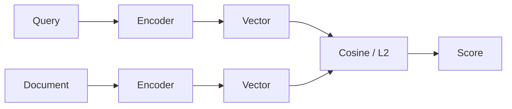
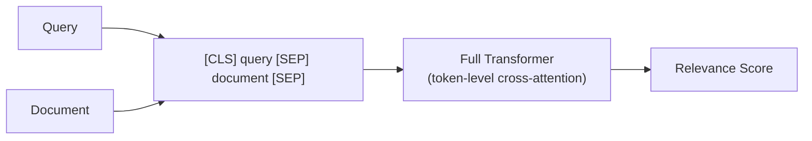
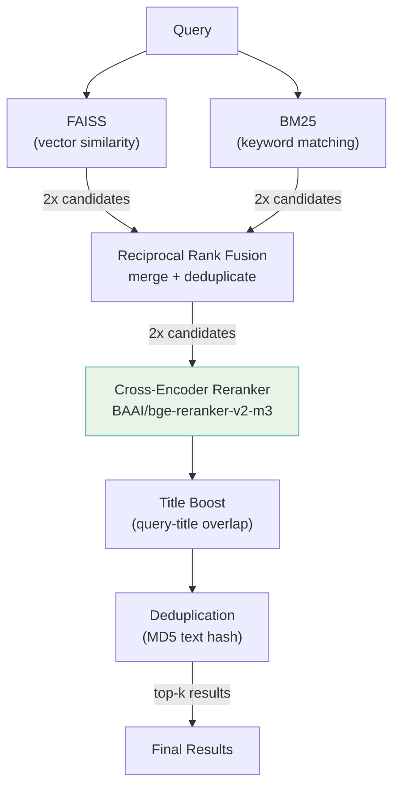
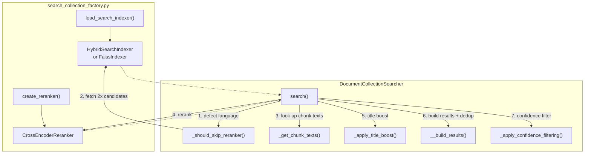

# Cross-Encoder Reranking

A third stage in the search pipeline that re-scores candidates using a cross-encoder model, significantly improving precision over bi-encoder retrieval alone.

## The Problem

Hybrid search (FAISS + BM25 with RRF) retrieves relevant documents, but its ranking is based on pre-computed embeddings and keyword overlap — neither of which captures fine-grained query-document interaction.

Consider searching for "regler for arbeid i utlandet" (rules for working abroad):
- FAISS finds semantically similar chunks about travel policies, remote work, and international projects
- BM25 boosts chunks containing the exact words
- RRF merges the two lists, but a chunk about "packing rules for business travel" might outrank one about "regulatory framework for posted workers" simply because both retrievers returned it

The core issue: bi-encoders embed query and document *independently*. They cannot model how specific query terms relate to specific document terms.

## How Cross-Encoder Reranking Works

A **bi-encoder** (used in FAISS retrieval) encodes query and document separately, then compares vectors:



A **cross-encoder** reads query and document *together* through the full transformer, enabling token-level attention between them:



Cross-encoders are far more accurate but too slow to run against an entire collection. The solution: use fast retrieval (FAISS + BM25) to get candidates, then rerank the top candidates with the cross-encoder.

## Search Pipeline

The full pipeline has three stages: retrieval, fusion, and reranking.



The overfetch multiplier is **2x** at the searcher level:
- If the user requests 15 results, the searcher asks the hybrid indexer for 30
- The hybrid indexer itself fetches 3x internally (90 per retriever) and returns 30 after RRF fusion
- The cross-encoder scores all 30 candidates and returns the top 15
- Title boost is applied after reranking (before building final results)
- Duplicate documents (identical text content) are removed during result building

## Architecture



The searcher coordinates the flow:
1. Detects query language — English queries (3+ words) skip the reranker to avoid cross-lingual score collapse
2. Asks the indexer for 2x the requested results
3. Looks up actual chunk text from disk (the cross-encoder needs the raw text, not vectors)
4. Passes query + chunk texts to the reranker
5. Applies title boost — documents whose filename matches query terms get a score bonus (-0.5 per term, capped at -1.5)
6. Builds final results with deduplication (MD5 hash of document text, first occurrence kept)
7. Applies confidence filtering — noise results removed, weak results flagged

## Score Convention

All scores use **lower = better** for consistency:

| Stage | Native scoring | Stored as |
|-------|---------------|-----------|
| FAISS (L2) | Lower distance = better | As-is (already lower = better) |
| RRF | Higher sum = better | Negated: `-score` |
| Cross-encoder | Higher relevance = better | Negated: `-score` |

This means downstream consumers can always sort ascending to get best results first.

## Performance

The cross-encoder adds latency proportional to the number of candidates reranked:

| Component | Typical latency |
|-----------|----------------|
| FAISS + BM25 retrieval | ~10-50ms |
| Cross-encoder reranking (30 candidates) | ~500-1000ms (MPS GPU, batch_size=8) |
| Title boost + dedup | <1ms |

Model details:
- **Model**: `BAAI/bge-reranker-v2-m3` (multilingual, matches the e5-base embedding language coverage)
- **Loading**: ~2-3s on first load, shared across all collections
- **Memory**: ~1.1 GB (loaded once per process)

## Key Files

| File | Role |
|------|------|
| `main/indexes/reranking/cross_encoder_reranker.py` | Cross-encoder reranker using `sentence_transformers.CrossEncoder` |
| `main/core/documents_collection_searcher.py` | Orchestrates full pipeline: lang detect, fetch, rerank, title boost, dedup, confidence filter |
| `main/indexes/indexer_factory.py` | `create_reranker()` factory function |
| `main/factories/search_collection_factory.py` | Wires reranker into searcher (CLI entry point) |
| `knowledge_api_server.py` | Shares one reranker instance across all collections |
| `multi_collection_search_mcp_adapter.py` | Shares one reranker instance for MCP search |

## Configuration

The reranker is **on by default** — all search entry points create and inject it:

- **CLI** (`search_collection_factory.py`): Creates reranker per invocation
- **Knowledge API** (`knowledge_api_server.py`): Single shared instance at startup
- **MCP adapter** (`multi_collection_search_mcp_adapter.py`): Single shared instance at startup

The model instance is shared across collections to avoid duplicate memory usage. No configuration flags are needed — if `sentence-transformers` is installed (it already is for embeddings), reranking works automatically.

To use a different model, pass `model_name` to `create_reranker()`:
```python
reranker = create_reranker(model_name="BAAI/bge-reranker-v2-m3")
```

## Cross-Lingual Query Detection

The cross-encoder reranker (BAAI/bge-reranker-v2-m3) collapses scores to near-zero for English→Norwegian query-document pairs, even when FAISS retrieval found the right documents. Example: "oversikt over goder og fordeler" scores -0.368 but the equivalent "employee benefits overview" scores -0.018.

The searcher detects English queries using `langdetect` and skips the reranker entirely, returning FAISS+BM25 hybrid scores directly. This also skips confidence filtering (thresholds are calibrated for cross-encoder scores).

Rules:
- Requires 3+ words for reliable language detection (short queries always use reranker)
- `DetectorFactory.seed = 0` for deterministic results
- Falls back gracefully if `langdetect` is not installed

**Observed limitation:** Without the reranker, English queries get flat scores (~50-51% relevance) and results can be noisy. The embedding model doesn't bridge conceptual cross-lingual gaps well enough alone (e.g. "framework agreements" does not find "rammeavtaler"). Query translation before search would be the next improvement.

## Title/Path Match Boost

After reranking, documents whose filename matches query terms get a score bonus. This improves precision for "find the page about X" queries where the answer is a single page whose title contains the search terms.

- Title extracted from `documentPath` in the index mapping (last path component, `.json` stripped, `-`/`_` replaced with spaces)
- Boost: `-0.5` per matching token, capped at `-1.5`
- All chunks from the same document get the same boost
- Scores re-sorted after boosting so result order changes
- Only applied when reranker is active (hybrid-only scores are too compressed)

**Observed impact:** 10-17 percentage point score increase on title-matching queries. Largest single improvement across all tested queries (e.g. "rammeavtaler" → Rammeavtaler.md from unranked to #1 at 80.6%).

## Result Deduplication

Some Notion pages are templates duplicated under multiple parent paths (e.g. "Lag pameldingsskjema" appears 3 times with identical content). BM25 surfaces all copies, wasting result slots.

During result building, each new document's `text` field is MD5-hashed. If the hash was already seen, the document is skipped. The first occurrence (highest-ranked) is kept. Uses the existing document cache — zero extra I/O.
