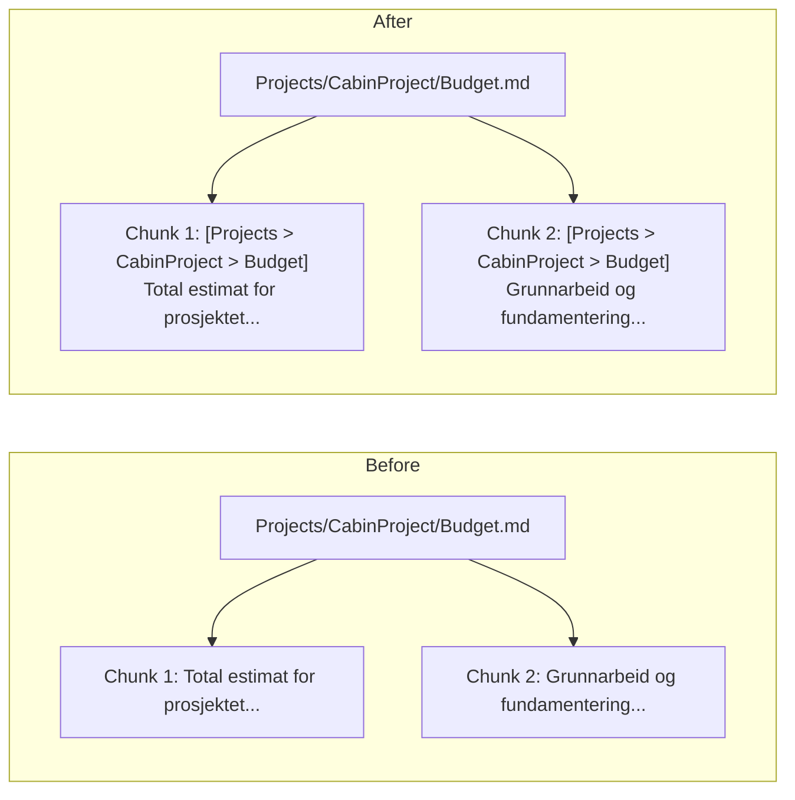
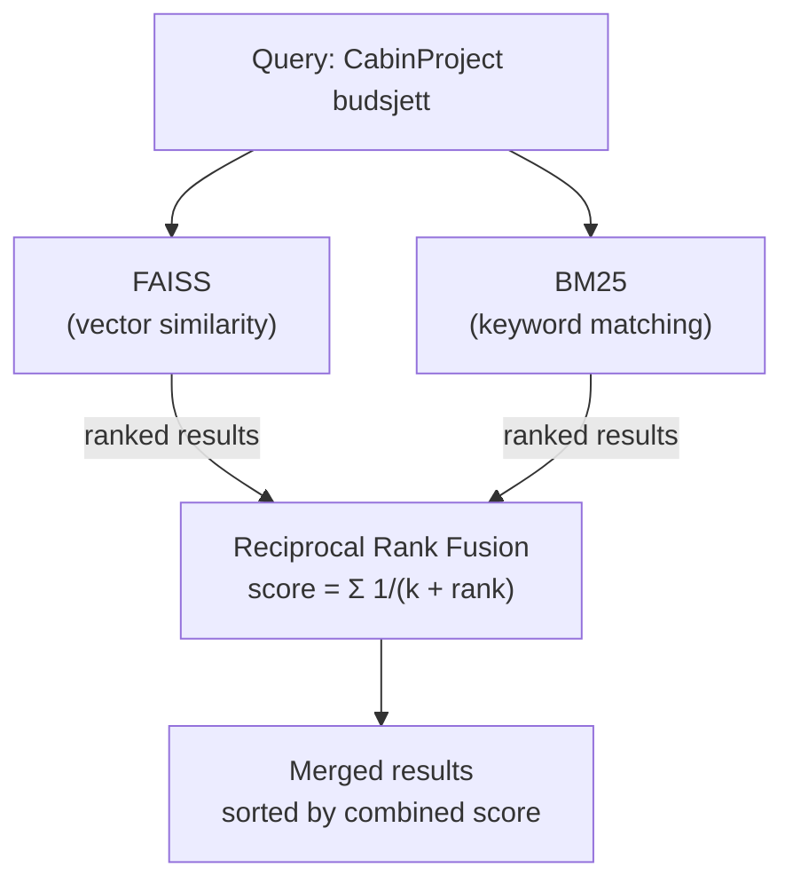
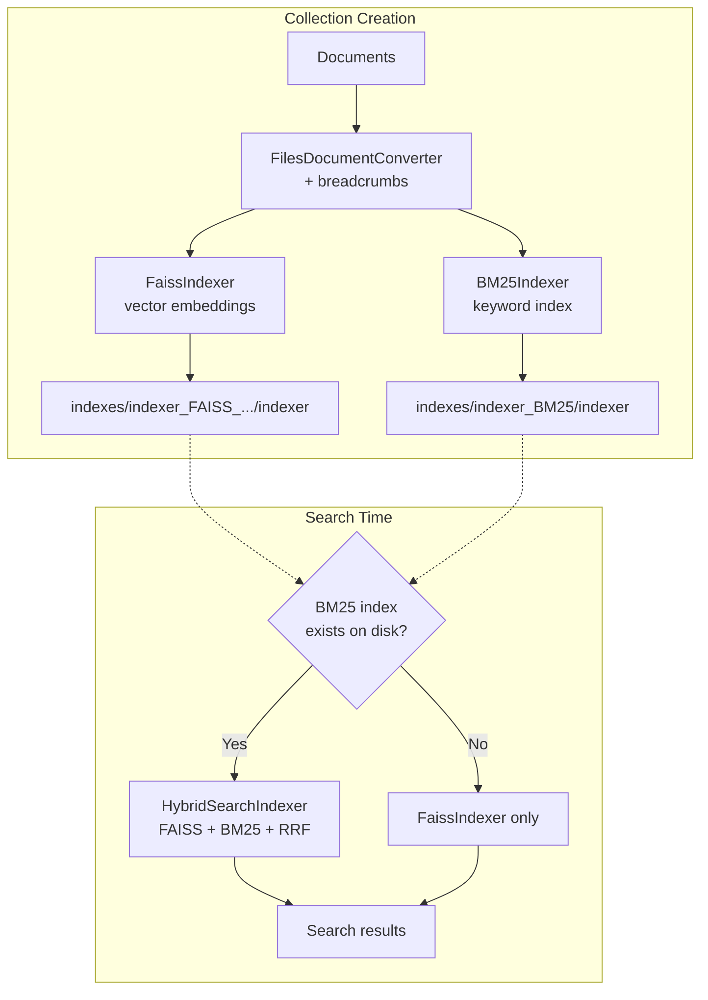

# Hybrid Search & Contextual Breadcrumbs

Two improvements to document retrieval quality: **contextual breadcrumbs** that preserve hierarchy in every chunk, and **hybrid BM25/FAISS search** that combines keyword matching with vector similarity.

## Contextual Breadcrumbs

When documents are chunked for indexing, each chunk loses context about where it belongs in the hierarchy. A chunk from `Projects/CabinProject/Budget.md` becomes an orphaned text fragment with no structural context.

Breadcrumbs solve this by prepending the document's path as a human-readable prefix to every chunk:

```
[Projects > CabinProject > Budget]
Total estimat for prosjektet er 4.2M NOK fordelt på...
```

This means the embedding vector now encodes both the content *and* its hierarchical context.



### Implementation

`FilesDocumentConverter.__build_breadcrumb()` converts the file's relative path:

1. Split path on `/`
2. Strip file extension from the last segment
3. Join with ` > ` and wrap in `[]`

The breadcrumb is:
- Used as the first chunk's `indexedData` (replacing the raw file path)
- Prepended to every content chunk's `indexedData`
- Used in `__build_document_text()` instead of the raw path

## Hybrid BM25/FAISS Search

FAISS (vector similarity) is good at semantic matching — "budget estimate" finds "cost projection". But it often misses exact keywords like proper nouns, project names, or technical terms.

BM25 (keyword matching) finds exact terms reliably but has no semantic understanding.

Hybrid search runs both and merges results using **Reciprocal Rank Fusion (RRF)**.



### How RRF Works

Each retriever returns a ranked list. For each document, its RRF score is the sum of `1 / (k + rank)` across all retrievers that returned it. Documents appearing in both lists get boosted.

```
FAISS results:  [DocA rank=0, DocB rank=1, DocC rank=2]
BM25 results:   [DocB rank=0, DocD rank=1, DocA rank=2]

RRF scores (k=60):
  DocA: 1/(60+0) + 1/(60+2) = 0.0167 + 0.0161 = 0.0328  ← both retrievers
  DocB: 1/(60+1) + 1/(60+0) = 0.0164 + 0.0167 = 0.0331  ← both retrievers
  DocC: 1/(60+2)            = 0.0161                       ← FAISS only
  DocD: 1/(60+1)            = 0.0164                       ← BM25 only

Final ranking: DocB, DocA, DocD, DocC
```

Documents found by both retrievers surface to the top. The `k=60` constant dampens rank differences so a rank-1 vs rank-5 result doesn't create an extreme score gap.

### Architecture



### Backward Compatibility

All three search entry points (CLI, MCP adapter, Knowledge API server) check for the BM25 index on disk before loading:

```python
bm25_path = f"{collection_name}/indexes/indexer_BM25/indexer"
if persister.is_path_exists(bm25_path):
    # Wrap FAISS + BM25 in HybridSearchIndexer
else:
    # Use FAISS only (same behavior as before)
```

Old collections without a BM25 index continue to work unchanged. To enable hybrid search, recreate the collection — both indexes are now built by default.

## Key Files

| File | Role |
|------|------|
| `main/indexes/indexers/bm25_indexer.py` | BM25 keyword indexer using `rank_bm25.BM25Okapi` |
| `main/indexes/indexers/hybrid_search_indexer.py` | RRF merger (search-only, not used during indexing) |
| `main/indexes/indexer_factory.py` | `load_search_indexer()` auto-detects BM25 for hybrid |
| `main/sources/files/files_document_converter.py` | Breadcrumb generation and chunk prepending |
| `files_collection_create_cmd_adapter.py` | Default indexers now include both FAISS and BM25 |

## Recreating a Collection

```bash
uv run files_collection_create_cmd_adapter.py \
    --basePath "./data/sources/my-notion" \
    --collection "my-notion" \
    --excludePatterns "^\.excluded/.*"
```

Verify both indexes exist:
```
data/collections/my-notion/indexes/indexer_FAISS_.../indexer  ← vector index
data/collections/my-notion/indexes/indexer_BM25/indexer       ← keyword index
```
