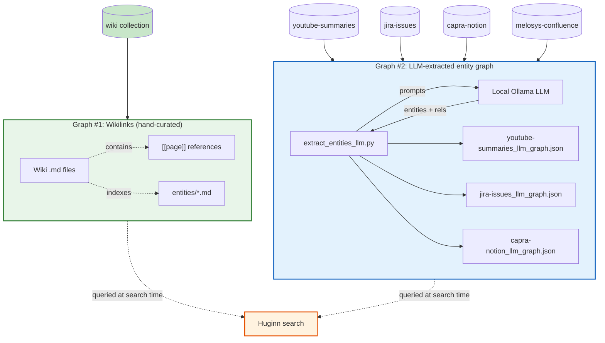
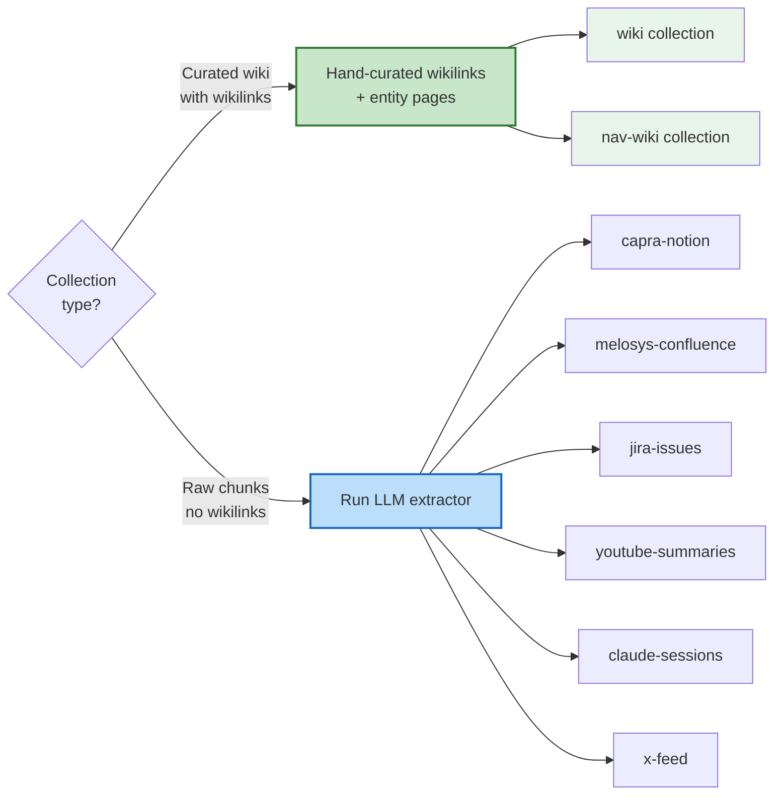
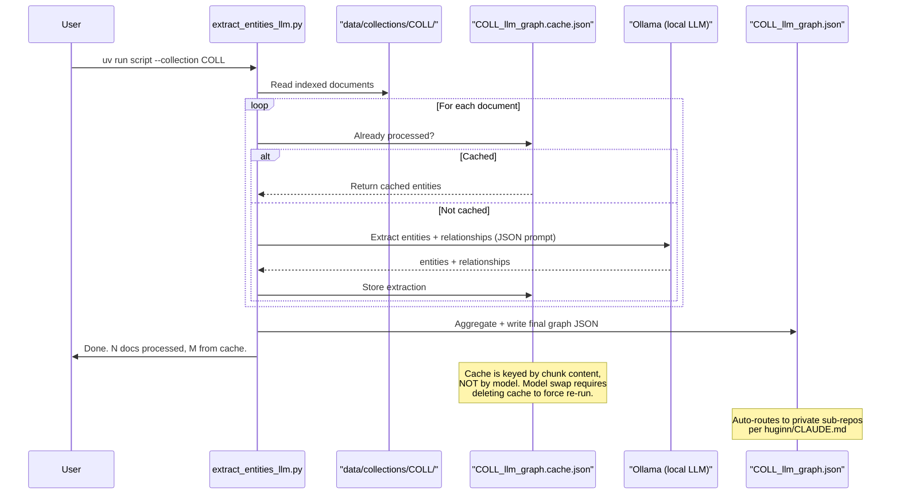
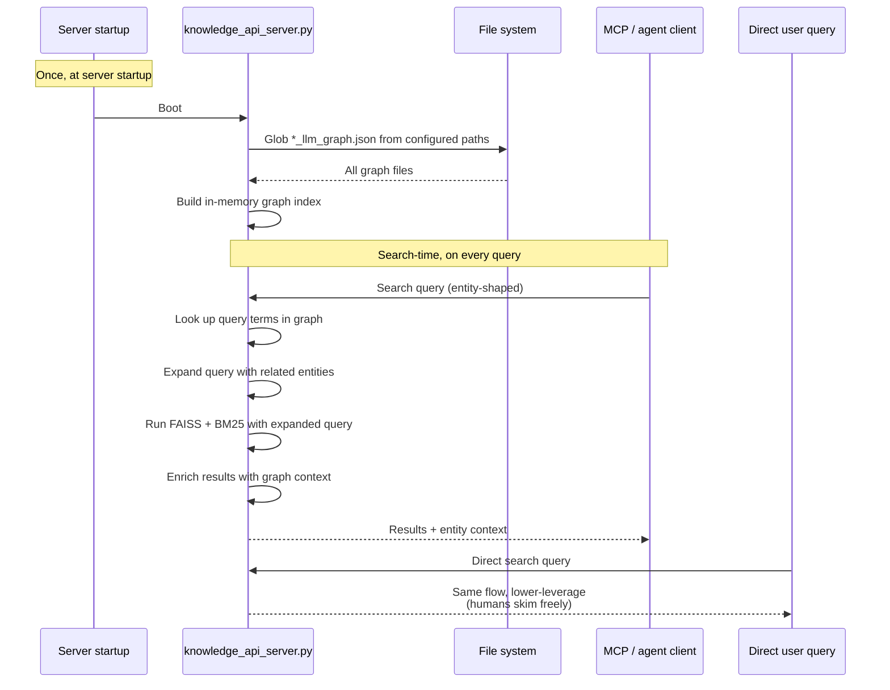
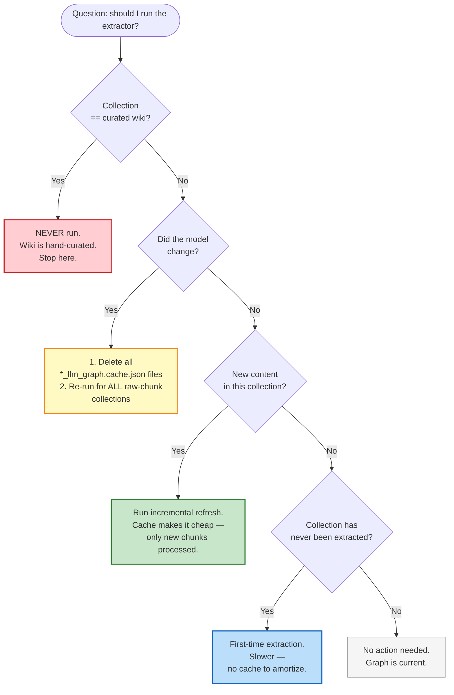

# Knowledge Graphs in Huginn — When to Use What

Huginn search can be enriched by **two independent kinds of knowledge graph**. They serve different collections in different ways. Confusing them — particularly running the LLM extractor on a hand-curated wiki collection — is the most common operational mistake. This doc maps which graph fits which collection and how to operate each.

> **Prerequisite reading**: [`HOW_IT_WORKS.md`](HOW_IT_WORKS.md) explains the FAISS+BM25 pipeline that the graph layer sits on top of. The graph is a *search-time enrichment*, not part of indexing.

## TL;DR

| Collection style | Graph type | Built by | Run the extractor? |
|---|---|---|---|
| Hand-curated wiki (markdown with `[[wikilinks]]` + entity pages) | Wikilinks | Human or LLM-as-maintainer | **No.** The wiki *is* the graph. |
| Raw chunks (Confluence, Jira, Notion, YouTube transcripts, X timeline, Claude sessions) | LLM-extracted entity graph | `extract_entities_llm.py` calling local Ollama | **Yes.** Without it, the only structure is FAISS+BM25 over raw text. |

## The two graphs



Key facts:

- The two graphs are **independent** — they don't share data, don't compete, and serve different collections.
- **Wikilinks live inside the `.md` files** as `[[page]]` references. There is no separate file. The wiki *is* the graph. See [`wiki-collection-pattern.md`](wiki-collection-pattern.md) for how to structure such a collection.
- **LLM-extracted graphs live as `<collection>_llm_graph.json`** alongside `<collection>_llm_graph.cache.json`, generated by `scripts/knowledge_graph/extract_entities_llm.py`.
- Both graphs are **consumed at search time**, not at ingest time. They enrich queries (expansion) and annotate results (entity context).

## The asymmetry — which collections get which



### Why the asymmetry?

| Collection | Run extractor? | Why |
|---|---|---|
| `wiki`, `nav-wiki` (any LLM-Wiki-Pattern collection) | **No** | Already a hand-curated knowledge graph. Running the LLM extractor would add **redundant entities** and risk **naming drift** — e.g. `Boris` vs `Boris Cherny` vs `Boris (Anthropic)`. The wikilinks express the canonical relationships; the entity pages canonicalize the names. |
| `capra-notion`, `melosys-confluence-v3` | **Yes** | Raw Notion / Confluence pages with no wikilinks. LLM graph is the only structured enrichment. |
| `jira-issues` | **Yes** | Raw Jira issue export. There's also a separate purpose-built `extract_jira_graph.py` for Jira-specific epic/cross-reference structure — the two graphs compose. |
| `youtube-summaries`, `claude-sessions`, `x-feed` | **Yes** | Raw transcripts / posts. Same logic. |

> ⚠️ **The wiki-skip is a deliberate design choice, not a TODO.** If a future operator (or a future LLM session) suggests *"wiki collection has never had a graph extracted, let's run it"*, that suggestion is wrong. The asymmetry is the point.

## The script flow



### Script details

- **Entry point**: `scripts/knowledge_graph/extract_entities_llm.py`
- **Default model**: `qwen3.6:35b-a3b-coding-nvfp4` (configurable via `--model`)
- **Ollama endpoint**: `http://localhost:11434/api/chat` with `format: "json"` and `temperature: 0`
- **Per-doc prompt budget**: first 3000 characters of the document — keeps per-call cost bounded
- **Entity extraction limits**: 5–15 per document; types restricted to `Technology | Person | Concept | Organization | Product`
- **Relationship types**: `uses | built_by | part_of | related_to | alternative_to | created_by | improves`
- **Cache write frequency**: after each doc — safe to interrupt; resume picks up where you left off
- **Auto-routing**: outputs land in collection-appropriate private sub-repos per `huginn/CLAUDE.md` (NAV collections → `huginn-nav/scripts/knowledge_graph/`, others → `huginn-jarvis/scripts/knowledge_graph/`); the API server auto-loads all `*_llm_graph.json` from those paths at startup

> ⚠️ **Cache invalidation on model swap is not automatic.** The cache file stores `{doc_id: entities}` — it doesn't track which model produced the entities. If you swap models and re-run, the script will *skip* every cached document and only call the new model on previously-uncached ones. Result: a hybrid graph mixing two models' output. **Delete the `*_llm_graph.cache.json` files before re-running with a different model.**

## How the API server consumes the graphs



Notes:

- **Loaded once at startup** — the server doesn't re-read graph files on every query. Restart the server after regenerating a graph if the server is running.
- **Used at search time, not ingest time.**
- **Two enrichment effects**:
  1. *Query expansion* — search for "Karpathy" and the graph adds related entities like "AutoResearch", "LLM Wiki", "Eureka Labs"
  2. *Result enrichment* — search hits are annotated with the entities they mention, useful for downstream display
- **MCP/agent clients benefit more than direct human queries** — bots structure queries entity-first; humans just type words. Entity-recall improvements matter most for bot-mediated retrieval.

## Decision flow — should I re-run the extractor?



### The four operating modes

#### Mode A — Curated wiki collection (always skip)

The wiki *is* the curated graph. Running the LLM extractor would add noise. There is no scenario in which it improves search quality. See [`wiki-collection-pattern.md`](wiki-collection-pattern.md) for how the wiki collection pattern works and why it composes with — but never replaces — the LLM extractor.

#### Mode B — Model swap (delete caches + re-extract everything)

```bash
# Backup first if you care about the old graphs
cp -r path/to/knowledge_graph /tmp/graph-backup-$(date +%F)

# Delete caches to force re-extraction
rm path/to/knowledge_graph/*.cache.json

# Re-extract every collection that has a graph
cd /path/to/huginn
uv run scripts/knowledge_graph/extract_entities_llm.py --collection capra-notion
uv run scripts/knowledge_graph/extract_entities_llm.py --collection jira-issues
uv run scripts/knowledge_graph/extract_entities_llm.py --collection youtube-summaries
# ... repeat for each raw-chunk collection that has an existing graph
```

#### Mode C — Incremental refresh after new content

Cache stays in place. Script processes only the new chunks. Cheap.

```bash
uv run scripts/knowledge_graph/extract_entities_llm.py --collection youtube-summaries
```

#### Mode D — First-time extraction for an unprocessed collection

No cache exists yet — full pass over the collection. Slower than incremental but only happens once.

```bash
uv run scripts/knowledge_graph/extract_entities_llm.py --collection x-feed
```

## Cheat sheet

| Situation | Action |
|---|---|
| Just finished maintaining a wiki collection | Nothing — wikilinks are the graph |
| Just fetched new content into a raw-chunk collection | Incremental refresh on that collection |
| Just changed the Ollama model | Delete all caches, re-extract every raw-chunk collection |
| API server is running, just regenerated a graph | Restart the server to pick up the new graph |
| Considering running the extractor on a wiki collection | Don't — re-read this doc |
| New raw-chunk collection added | One-time first extraction |
| Per-source bespoke graph available (e.g. `extract_jira_graph.py` for Jira epics/cross-refs) | Run alongside the LLM extractor — they compose |

## See also

- [`HOW_IT_WORKS.md`](HOW_IT_WORKS.md) — the FAISS+BM25 pipeline this graph layer enriches
- [`graph-enhanced-rag.html`](graph-enhanced-rag.html) — full architecture
- [`wiki-collection-pattern.md`](wiki-collection-pattern.md) — how to structure a hand-curated wiki collection (the alternative to LLM extraction)
- [`README.md`](../README.md) § Knowledge Graph — the entry-point summary
- `huginn/CLAUDE.md` § *LLM entity extraction (knowledge graph)* — per-script reference and current model name
