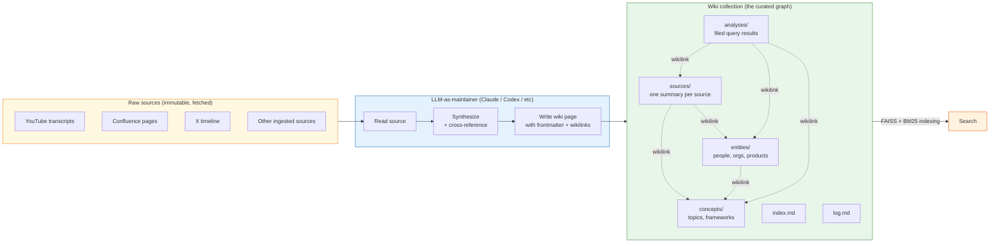
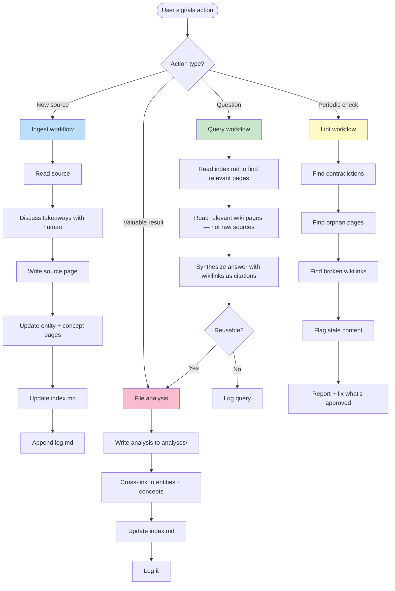
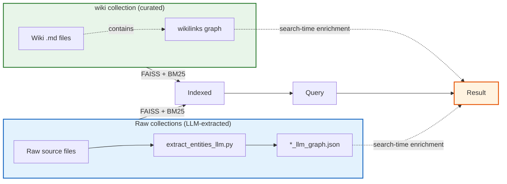

# The Wiki Collection Pattern

A **wiki collection** is a Huginn collection where the documents are not raw source pages but a **hand-curated knowledge base** maintained by an LLM acting as a wiki editor. The wikilinks (`[[page]]` references) and entity pages *are* the knowledge graph — no LLM extraction needed. This doc explains the pattern, when to use it, how to structure it, and how it composes with the rest of Huginn.

> **Companion doc**: [`knowledge-graph-when-to-use-what.md`](knowledge-graph-when-to-use-what.md) covers the wiki-vs-LLM-extracted-graph asymmetry. Read that first if you're trying to decide whether to run the extractor on a given collection.

## The pattern in one diagram



The flow: raw sources stay immutable; an LLM reads them and writes summary pages, entity pages, and concept pages with wikilinks; the resulting wiki is itself indexed as a Huginn collection and queried alongside the raw collections.

## When to use this pattern

The wiki pattern is **the right answer** when:

- You want **durable knowledge synthesis** that survives across many sources — not just operational state from one session
- You're consuming a stream of related sources (videos, articles, papers, tickets) and want **cross-referencing** to compound over time
- You want **human-browsable knowledge** — markdown files in a folder, openable in [Obsidian](https://obsidian.md), Foam, or any markdown editor — not data hidden inside a vector DB
- You want the **graph as a side-effect of writing**, not as a separate post-processing step

The wiki pattern is **the wrong answer** when:

- You need **operational memory** from a single agent session (use Auto Dream, MemSearch, or similar instead)
- The source content is **already structured** and well-indexed (raw Confluence/Jira/Notion may not benefit — a wiki on top is just an extra hop)
- You don't have **disciplined LLM-as-maintainer workflow** — without consistent ingestion, the wiki rots fast
- You only need **search**, not synthesis — FAISS+BM25 over the raw sources may be enough

The pattern's lineage traces to [Andrej Karpathy's "LLM Wiki" pattern](https://gist.github.com/karpathy/) — *"raw sources compiled by the LLM into a cross-referenced wiki, then queried by the same LLM."*

## Directory structure

A canonical wiki collection looks like this:

```
my-wiki/
├── CLAUDE.md             # Schema and rules for the LLM-as-maintainer
├── index.md              # Catalog of all pages, organized by type
├── log.md                # Append-only chronological activity log
├── sources/              # One summary per ingested source
│   ├── Sources — YouTube.md       # Optional category catalogs
│   └── Specific Source Page.md
├── entities/             # People, organizations, products, places
│   ├── Person Name.md
│   └── Product Name.md
├── concepts/             # Topics, ideas, frameworks, methodologies
│   └── Concept Name.md
└── analyses/             # Filed query results, comparisons, syntheses
    └── Comparison Title.md
```

### Page format

Every wiki page starts with YAML frontmatter:

```yaml
---
type: source | entity | concept | analysis
title: "Page title"
aliases: ["Page title", "Alternative name"]
created: YYYY-MM-DD
updated: YYYY-MM-DD
tags: [tag1, tag2]
sources: ["[[Source Page]]"]
---
```

After frontmatter: the page body in standard markdown, using `[[wikilinks]]` for internal references and `## Headings` for structure. End substantive pages with a `## See also` section listing related `[[wikilinks]]`.

### Filenames match titles

Use the page title as the filename — `Boris Cherny.md`, `Context Management.md`, `Memory Systems Compared.md`. This makes `[[wikilinks]]` resolve correctly without alias indirection.

## The LLM-as-maintainer workflow

The LLM that maintains the wiki has a fixed schema (its `CLAUDE.md`) describing the rules and four core workflows:



This is the workflow shape from a working production wiki — adapt the specifics to your domain.

## How the wiki composes with the rest of Huginn



The two graph types live side-by-side in the same Huginn instance. They enrich the *same query* in different ways:

- The wiki collection contributes **canonical, cross-referenced summaries** with the wikilink graph
- The raw collections contribute **comprehensive coverage** with the LLM-extracted entity graph

A search for *"Boris Cherny"* will hit:

- Curated entity page in the wiki (high-precision, hand-written)
- Raw mentions across YouTube/X/Confluence/etc. with LLM-extracted entity context (high-recall, machine-extracted)

That's the composition. Don't run the LLM extractor on the wiki — it would duplicate the wiki's own canonical entities with machine-extracted near-duplicates.

## Practical setup

To make a new wiki collection:

```bash
# 1. Create the directory structure
mkdir -p my-wiki/{sources,entities,concepts,analyses}
touch my-wiki/{index.md,log.md,CLAUDE.md}

# 2. Write a CLAUDE.md describing the schema and rules
#    (see this repo's huginn-jarvis/data/wiki/CLAUDE.md for a working example)

# 3. Index it as a Huginn collection
cd /path/to/huginn
.venv/bin/python files_collection_create_cmd_adapter.py \
  -collection my-wiki \
  -basePath ./my-wiki \
  -excludePatterns '^index\.md$' '^log\.md$' '^CLAUDE\.md$'

# 4. Use Claude Code (or another LLM) with the CLAUDE.md as the schema
#    to ingest sources, write pages, lint, and answer queries
```

The standard exclusions (`index.md`, `log.md`, `CLAUDE.md`) keep the catalog/log/schema files out of search results — they're navigational, not content.

> ⚠️ **Do not run the LLM extractor on this collection.** It already *is* the curated graph. See [`knowledge-graph-when-to-use-what.md`](knowledge-graph-when-to-use-what.md) for the asymmetry.

## Re-indexing after wiki updates

The wiki collection is just files; standard Huginn re-indexing applies:

```bash
cd /path/to/huginn
.venv/bin/python files_collection_create_cmd_adapter.py \
  -collection my-wiki -basePath ./my-wiki \
  -excludePatterns '^index\.md$' '^log\.md$' '^CLAUDE\.md$'
```

After re-indexing, check the manifest at `data/collections/my-wiki/manifest.json`:

- Confirm `numberOfDocuments` matches what you expect
- Confirm `excludePatterns` show **single backslashes** in JSON (e.g. `"^\\.excluded/.*"`, not `"^\\\\.excluded/.*"`) — double backslashes silently break the regex and index everything

## Trade-offs

| Aspect | Wiki collection | Raw collection + LLM extractor |
|---|---|---|
| **Setup cost** | High — needs schema, LLM-as-maintainer workflow, ongoing curation | Low — point at folder, run script |
| **Query precision** | High — canonical entities, hand-curated cross-references | Medium — depends on extractor quality |
| **Coverage** | Limited to what's been ingested into the wiki | Full — every raw chunk |
| **Naming consistency** | High — single canonical entity page per concept | Risk of drift (`Boris` / `Boris Cherny` / `Boris (Anthropic)`) |
| **Browsability** | High — markdown in folders, opens in any editor | Low — JSON file you don't read directly |
| **Refreshes** | Manual via LLM workflow | Automated; cache makes incremental refresh cheap |
| **Best for** | Durable knowledge synthesis | Operational coverage of raw streams |

You don't have to pick one — most working setups have both, with the wiki for synthesis and the raw collections + LLM graphs for coverage.

## See also

- [`knowledge-graph-when-to-use-what.md`](knowledge-graph-when-to-use-what.md) — the wiki-vs-LLM-extracted asymmetry decision flow
- [`HOW_IT_WORKS.md`](HOW_IT_WORKS.md) — the FAISS+BM25 pipeline this collection sits on top of
- [`README.md`](../README.md) § *Advanced: Private Domain Collections* — the pattern of having multiple wiki sub-repos for different domains
- [Karpathy's LLM Wiki gist](https://gist.github.com/karpathy/) — original write-up of the pattern
